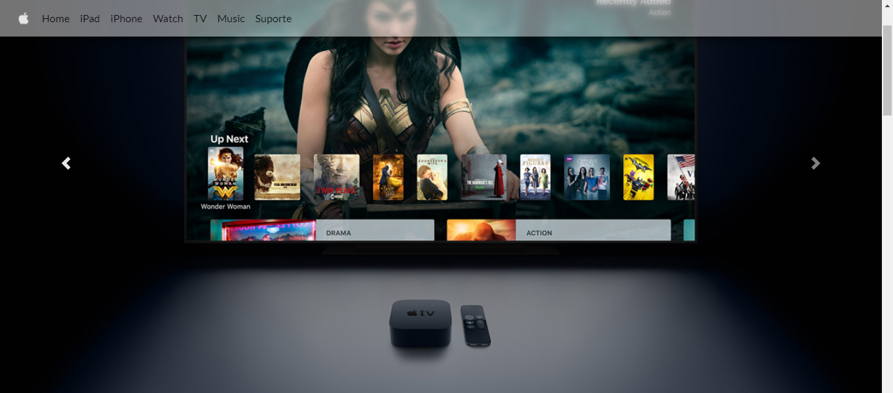
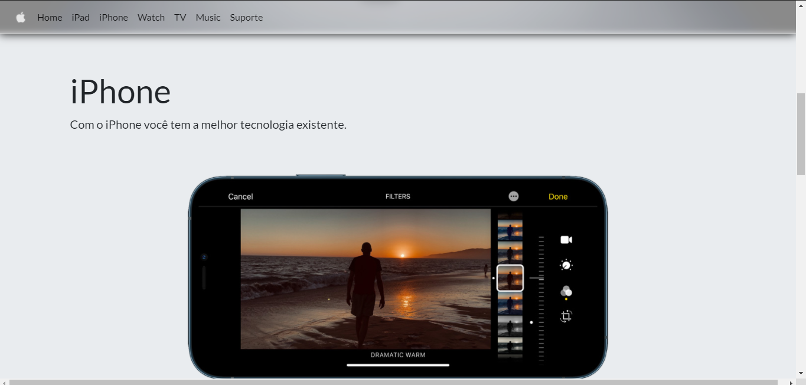
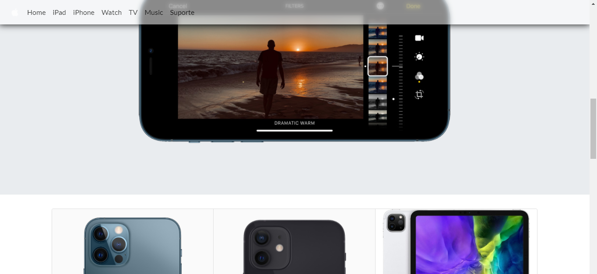

# exercicio-bootstrap
Modelo de site landinpage inspirado na Apple Store, feito com HTML, CSS, JAVASCRIPT, BOOTSTRAP e algumas alterações em classes de CSS para chegar mais próximo do modelo original.

